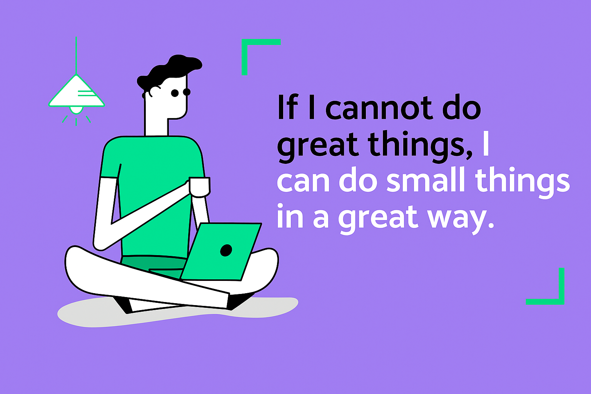

<h1 align="center">Hi 👋, I'm Prerana Khanal</h1>

<!-- Banner Image -->

  

 

## About me

- 🎓 A Cybersecurity student passionate about **building a safer digital world**
- 💬 Ask me about **Frontend development or how to get started in cybersecurity**

- 💻 A growing Frontend Developer who loves turning ideas into **responsive, accessible, and user-friendly interfaces**

- 🧠 Fun fact: **I enjoy breaking down complex problems and simplifying them in code**

- 📧 How to reach me: **preranakhanal42@gmail.com**

- 💡 Motto: **Design smart. Code clean. Keep learning.**

## 👥 Connect with me:

  
  
  
  

## 🛠️ Languages and Tools:

  
  
  
  
  
  
  
  
  
  
  
  
  

## 📊 GitHub Stats:

&nbsp;

